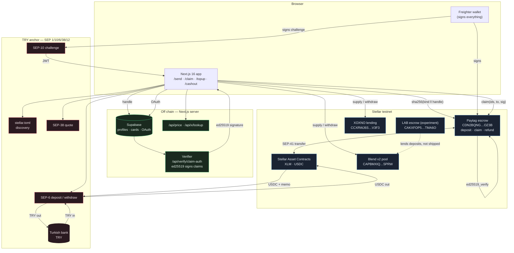
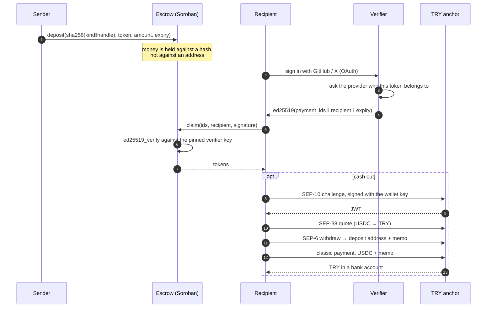

# Paytag

**Send money to a GitHub or X username, before that person has a wallet — and
let them cash it out in Turkish lira without ever seeing a blockchain.**

You pay `github.com/torvalds` or `x.com/someone`. The money goes into a Soroban
contract on Stellar, tagged with a hash of the handle rather than an address.
The recipient turns up whenever they like, proves the account is theirs by
signing in with it, and takes the money — to a wallet, to a lending pool, or to
a Turkish bank account as lira. If nobody turns up, the sender takes it back
once the claim window closes.

Live on Stellar testnet: **[paytag-six.vercel.app](https://paytag-six.vercel.app)**

| | |
| --- | --- |
| Contract | Rust, `soroban-sdk` 26, deployed to testnet ([ids](#deployed-artifacts), [tx hashes](docs/evidence/tx-hashes.md)) |
| App | Next.js 16 on Vercel, GitHub and X sign-in working |
| Fiat rail | TRY ↔ USDC through a SEP-6 anchor, both directions, end to end |
| DeFi | Blend v2 and XOXNO lending, offered on the claim screen |
| Tests | 72 contract tests, 231 web tests, all in CI |
| Money | Testnet only. Nothing here is worth anything. |

---

## The problem

Stellar moves money well, but paying a developer or a creator means knowing
their wallet address first. Most people who deserve to be paid do not have one,
and asking for it is where a donation or a bounty payout usually dies.

**v1 removed the wallet from the sender's side of the problem.** You pay a name.

**v2 removes the blockchain from the recipient's side.** The money arrives as a
handle they already own, and leaves as lira in a bank account they already have.
Between those two moments Stellar does the work and never asks to be understood.

**Who benefits.** Open-source maintainers and creators in Turkey who are paid
from abroad, and the people who want to pay them. Today that is a wallet address
over DM, a bank wire nobody wants to pay the fee on, or nothing at all.

---

## Architecture



### The two flows that matter



---

## Components and what each is responsible for

| Component | Responsibility |
| --- | --- |
| `contracts/escrow` | Holds money against an identity hash. Verifies the claim signature, enforces the expiry window, refunds the sender. Knows nothing about GitHub, X, or which asset it holds. |
| `web/lib/identity.ts` + `scripts/paytag.mjs` | `identity_key = sha256(kind_byte ‖ normalized_handle)`, computed identically in Rust, Node and the browser. A parity test pins all three to the same bytes. |
| `web/app/api/verify/claim-auth` | The verifier. Turns a proven OAuth identity into an ed25519 signature the contract will accept. Server-only module; the key never reaches a bundle. |
| `web/lib/anchor/*` | The fiat rail. `toml.ts` (SEP-1 discovery + asset identity check), `auth.ts` (SEP-10), `sep38.ts` (quotes), `sep6.ts` (deposit/withdraw/polling), `trustline.ts`, `payment.ts` (the classic payment that carries the memo). |
| `web/lib/blend/*`, `web/lib/xoxno/*` | Recipient-side lending. Position reading, supply/withdraw building, live projection of what a position is earning. |
| `web/lib/assets.ts` | Groups unclaimed payments by asset so nothing a recipient owns is hidden behind a currency selector. |
| `db/schema.sql` | Supabase: profiles, contribution cards, RLS policies, and the tests that prove the policies reject what they should. |
| `contracts/lab-yield` + `/lab` | An experiment, deployed separately, wired to nothing. [Its report](docs/LAB-YIELD-ESCROW.md) is the reason it is not in the product. |

---

## Stellar integrations

### 1. Anchor — a real TRY rail, both directions

The core of the v2 work, and the part that makes Paytag a payment product rather
than a crypto demo. Implemented directly against the SEPs, no SDK wrapper:

| SEP | Where | What it does here |
| --- | --- | --- |
| **SEP-1** | `lib/anchor/toml.ts` | Discovers the anchor from its home domain and **re-derives the asset's contract id from the `code` and `issuer` it publishes**, refusing to continue if it is not the USDC the app is configured for. |
| **SEP-10** | `lib/anchor/auth.ts` | The challenge transaction is signed with the user's wallet and never submitted. The resulting JWT is held in memory only. |
| **SEP-38** | `lib/anchor/sep38.ts` | Indicative prices in both directions, shown before anything is signed — and labelled as estimates, because what is charged is settled by the transfer itself. |
| **SEP-6** | `lib/anchor/sep6.ts` | Programmatic deposit and withdraw, with transaction polling to completion. |
| **SEP-12** | (simulated) | The sandbox anchor accepts the KYC fields; a production rail would put a real provider behind the same call. |

*On-ramp* (`/topup`): quote → SEP-6 deposit → bank instructions → simulated
transfer → USDC lands in the wallet, trustline opened automatically if missing.

*Off-ramp* (`/cashout`): quote → SEP-6 withdraw → a **classic** payment carrying
the anchor's memo → TRY to the bank. It is classic and not Soroban for a reason
given under trade-offs.

### 2. Blend v2 and XOXNO — yield on money that has arrived

After a claim, the recipient can put the money to work without leaving Paytag.
One card, two venues, real positions read off chain, and a counter that ticks
from the venue's own APY so the number moving on the screen is the number the
protocol is paying.

- Blend: `submit` with supply/withdraw requests, positions read from both
  `supply` and `collateral`, BLND emissions read by simulating `claim`.
- XOXNO: controller + position-NFT model, supply index in RAY, full withdrawal.

**Both are opt-in, and on the recipient's side on purpose.** The alternative —
lending the escrow while it waits — was built, deployed, measured, and rejected;
[the report](docs/LAB-YIELD-ESCROW.md) has the numbers.

### 3. Soroban itself

Identity-keyed storage, `ed25519_verify` in the contract, TTL bumps on both
instance and payment entries, `contractevent` for every state change, and — in
the laboratory contract — `authorize_as_current_contract` scoped to a single
sub-invocation so a contract can let a pool move exactly one amount of one token.

---

## Key design decisions and trade-offs

**The verifier is trusted, and that is written down rather than buried.** A
contract cannot call GitHub. An off-chain verifier confirms ownership through
OAuth and signs with ed25519; the contract checks it. **If that key leaks,
whoever holds it can mint valid claims.** Mitigation path: a multisig verifier
set, or on-chain attestation. Two things narrow it today — the key is read only
in a `server-only` module, so a build that pulled it browser-ward fails instead
of shipping, and the handle is fetched from the provider with the fresh token
rather than read from session metadata, which the user can write.

**The escrow is asset-agnostic; the UI decides what is sendable.** `deposit`
takes a token address and moves money over SEP-41. Adding the anchor's USDC was
a config change, not a redeploy. The previous self-issued USDC stays *readable*
so old payments still display, and is not *sendable* — one list in
`lib/config.ts`.

**The off-ramp goes through the wallet, not the contract.** Anchors identify an
incoming withdrawal by its memo, and memos exist only on classic payments — a
Soroban token transfer cannot carry one. So the money is claimed to the wallet
first and paid to the anchor from there. Fewer steps would mean a custodial
bridge, which is a different product with a different licence.

**Amounts are typed in the asset, and the fiat figure is the estimate
underneath.** XLM or USDC is what leaves the wallet and what the contract holds;
the dollar figure is one API's opinion. A missing rate costs nothing — the
estimate disappears and the field keeps working.

**The X account check is metered, so it is gated.** GitHub answers for free from
the visitor's browser. X charges $0.010 a lookup, so it runs server-side behind
five gates and degrades to an honest "we could not confirm this account."
Arithmetic: [docs/API-COSTS.md](docs/API-COSTS.md).

---

## Technical challenges, and what they cost to solve

**An error code meant two different things.** A missing trustline surfaced as
"this payment has expired", because the escrow and the Stellar Asset Contract
both define error `13`. The fix was to make the decoder aware of which call it
was decoding — `lib/stellar.ts` now knows which codes each entry point can
actually throw, and attributes the rest to the token. Tests pin it.

**An anchor's asset has to be checked, not assumed.** A `stellar.toml` can name
any issuer. `assertSameAsset` derives the contract id from the published code
and issuer and compares it to the configured one, so a wrong or swapped anchor
fails discovery instead of silently taking the money somewhere else.

**XOXNO withdrawals hit `RESOURCE_LIMIT_EXCEEDED`.** Three contracts deep, the
simulation's own estimate was too tight. Doubling instructions and tripling the
resource fee before submitting fixed full withdrawals; partial ones still fail,
so the UI offers only "take it all back" rather than an action that does not
work.

**A mock that was easier to satisfy than reality hid a bug.** The laboratory
contract passed against a mock pool whose `b_rate` was a flat field; Blend nests
it under `data`, and the first live deposit reverted. The second finding was
worse: buying a position rounds down, so the contract briefly owed one stroop
more than it held. Both fixed, both now asserted in tests. Detail in
[docs/LAB-YIELD-ESCROW.md](docs/LAB-YIELD-ESCROW.md).

**Live counters kept killing their own animation.** Deriving the displayed value
during render instead of writing it in an effect, and animating only the digits
that actually changed, is what makes the earnings counter move smoothly without
re-mounting the element every poll.

---

## Deployed artifacts

All on **Stellar testnet**.

| What | Id |
| --- | --- |
| Paytag escrow | `CDN2BQNGHWCC22IXLAKBAVIOL5ID4MTH4FNYISVEARWQ4HZ27ZA7OZ3B` |
| XLM (SAC) | `CDLZFC3SYJYDZT7K67VZ75HPJVIEUVNIXF47ZG2FB2RMQQVU2HHGCYSC` |
| USDC (anchor's, SAC) | `CBIELTK6YBZJU5UP2WWQEUCYKLPU6AUNZ2BQ4WWFEIE3USCIHMXQDAMA` |
| USDC (legacy, readable only) | `CBU7HRUSXSVPI7QHA73G67UDRQTKSEOICFHWOMWSPOZ2S3R3DIWUCPKI` |
| Blend v2 pool | `CAPBMXIQTICKWFPWFDJWMAKBXBPJZUKLNONQH3MLPLLBKQ643CYN5PRW` |
| XOXNO controller | `CCXRWJ6SIU2WPFEGLFGJVITPL57QAYIMIO6OAM2NBGNDQSSCK2FFV3F3` |
| XOXNO position NFT | `CDVN5JU675MEDPVRPCYC45AHFC275UH57WEU5OTFE4WFGZBNN7HTLPSY` |
| LAB escrow (experiment) | `CAKXFOP56LVXR7MSQJSEWCZVAXUXOXVACDKRUXQ7GFOINSY4RYXTMA6O` |
| Anchor home domain | `tr-mock-anchor.fly.dev` |
| Verifier public key | `dbb4d698e7febec6390f19123733b526c1851b09491e57d3529eff78222b517b` |

Transaction hashes for deposit, claim and refund:
[docs/evidence/tx-hashes.md](docs/evidence/tx-hashes.md).

---

## Running and testing it

```bash
./scripts/setup-mac.sh               # Rust, wasm target, stellar-cli, funded testnet identity
cd contracts && cargo test           # 61 escrow tests + 11 laboratory tests
cd web && pnpm install && pnpm test  # 231 parity and unit tests
cd web && pnpm dev                   # http://localhost:3000
```

The testnet identity is funded by Friendbot. No real money is involved anywhere
in this repo.

**Sending and refunding need nothing but a wallet and the contract address.**
Claiming needs a GitHub OAuth App and a Supabase project — about twenty minutes,
free: [docs/SETUP-AUTH.md](docs/SETUP-AUTH.md). Skip it and the claim screen says
so rather than breaking.

**The anchor round trip has its own end-to-end test**, opt-in because it talks to
a live sandbox:

```bash
cd web && ANCHOR_E2E=1 pnpm vitest run lib/anchor/e2e.test.ts
```

**Evaluating it as a judge**, fastest path: open the deployed app, send XLM to
any GitHub handle from `/send`, then `/topup` to watch TRY become USDC, then
`/claim` if you own a handle that has been paid. `/lab` is the rejected
experiment and is deliberately absent from the deployed environment.

---

## Stellar Skills used

As required by the submission rules, by path:

- [`SKILL.md`](https://github.com/CheesecakeLabs/stellar-anchor-skill/blob/main/SKILL.md)
  — *Anchors*. The SEP-1 → SEP-10 → SEP-38 → SEP-6 ordering, the interactive vs
  programmatic distinction, the memo requirement on withdrawals, and the
  insistence that `asset_code` alone is ambiguous all came from here and shaped
  `web/lib/anchor/*`. Its checklist was then run against the finished
  implementation and **found a real defect**: SEP-10 fixes no JWT lifetime, and
  the withdrawal poll loop was carrying one token through a wait that can
  outlast it. Calls now take a token *getter* and re-sign transparently on a
  401 — `lib/anchor/auth.ts`, with the behaviour pinned in `sep6.test.ts`.
- [`skills/standards/SKILL.md`](https://github.com/stellar/stellar-dev-skill/blob/main/skills/standards/SKILL.md)
  — *SEPs, CAPs & Ecosystem*. Used to settle SEP-6 against SEP-24 for the ramps,
  and to confirm SEP-41 as the token interface the escrow should target.
- [`skills/scf-submission-radar/SKILL.md`](https://github.com/lumenloop/lumenloop-skills/blob/main/skills/scf-submission-radar/SKILL.md)
  — *SCF Submission Radar*. Used to position the post-hackathon plan in
  [docs/ROADMAP.md](docs/ROADMAP.md).

---

## What is built, and what is not

**Working:** paying a GitHub or X handle in XLM or USDC · GitHub and X
verification · claiming · refunding after expiry · per-asset display of
everything unclaimed · TRY on-ramp · TRY off-ramp · Blend and XOXNO lending with
live earnings · a public directory of people who can be paid · contribution
cards · a saved payout address · a "Sent by me" list.

**Reserved but not built:** repository identities (`owner/repo`) and Paytag
nicknames — both have a kind byte in the protocol and no verification path, so
the verifier refuses to sign for them.

**Built and deliberately rejected:** an escrow that lends while it waits
([why](docs/LAB-YIELD-ESCROW.md)).

**Next:** [docs/ROADMAP.md](docs/ROADMAP.md) — the path to SCF and InstAward.

**Judging this?** [docs/SUBMISSION.md](docs/SUBMISSION.md) has the whole
inventory: links, contract ids, how each hackathon requirement is met, the
evaluation path, and one known issue with the shared sandbox anchor.

---

## Secrets

Built private, published at delivery. Git history cannot be undone, so the
protection was in place before the first secret existed: `.gitignore`, a
pre-commit hook, a pre-push hook, and gitleaks scanning the entire history in
CI. The scanner has its own test suite (`scripts/test-scan-secrets.sh`), because
a scanner nobody tests is a scanner nobody can trust.

Hooks: `git config core.hooksPath .githooks`, which `scripts/setup-mac.sh` does
for you. Inventory: [docs/SECURITY.md](docs/SECURITY.md).

---

## Repo layout

```
contracts/escrow/     Rust, soroban-sdk 26. The escrow contract and its tests.
contracts/lab-yield/  The rejected experiment. Separate contract, separate id.
web/                  Next.js 16. Interface, verifier route, anchor and DeFi clients.
  lib/anchor/         SEP-1, SEP-10, SEP-38, SEP-6, trustlines, memo payments.
  lib/blend/          Blend v2 positions, supply/withdraw, BLND emissions.
  lib/xoxno/          XOXNO lending positions and supply index.
db/
  schema.sql          Supabase schema, always current. Tables, RLS policies, views.
  schema_test.sql     Behavioural test: ten rejection cases, two retention cases.
docs/
  SUBMISSION.md       Hackathon submission inventory and evaluation path.
  ROADMAP.md          Post-hackathon plan: SCF and InstAward.
  LAB-YIELD-ESCROW.md The lending-escrow experiment and why it was not shipped.
  SPEC.md             Protocol and data model. Identity keys, signatures, red team.
  SECURITY.md         Key inventory, layered defence, pre-public checklist.
  SETUP-AUTH.md       GitHub OAuth and Supabase, so claiming works.
  API-COSTS.md        What each external call costs and what stops it running away.
  DESIGN.md           The mark, the palette, the screens.
  DEPLOY.md           Going live on Vercel.
  PLAN.md             Phase-by-phase build plan, with a test criterion per step.
  evidence/           Transaction hashes, screenshots, logs.
scripts/
  setup-mac.sh        One-time development setup.
  paytag.mjs          Off-chain verifier CLI: identity keys, keygen, claim signing.
  scan-secrets.sh     Secret scanner, and its own test suite beside it.
```

## Out of scope

Chrome extension, KYC and legal workflows, revenue splits.

## License

MIT
